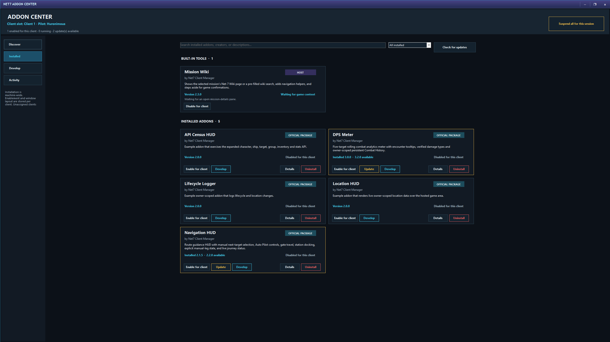
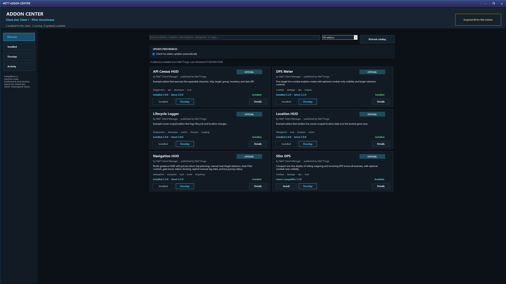
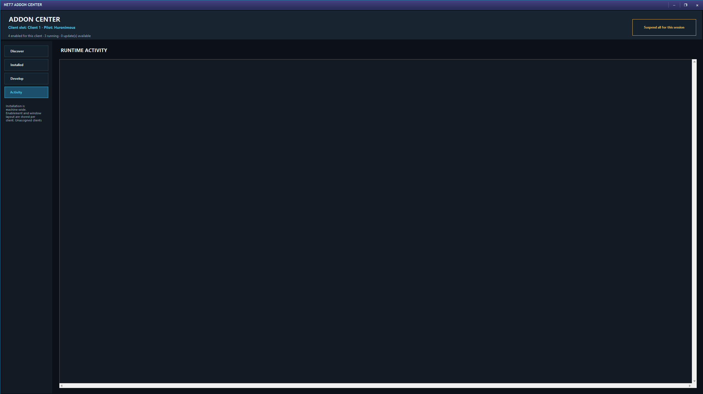
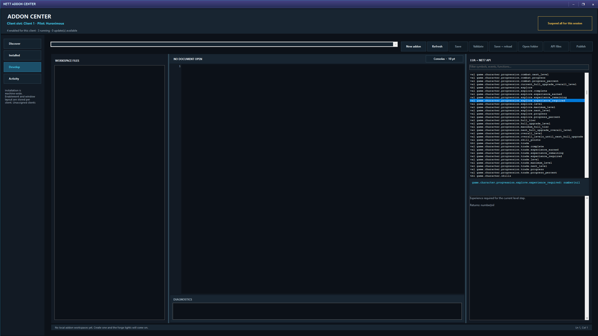

# Addon Center

The Addon Center extends the in-game Client Manager with optional windows, heads-up displays, tools, and information panels.

## Discover

The **Discover** page searches the Forge catalog by add-on name, creator, description, category, or tag.

Open an add-on to read its description, publisher, available versions, release notes, categories, and compatibility. Install the newest compatible version or choose another available version when appropriate.

Catalog cards distinguish official and community add-ons and explain when a version is incompatible or replaced by a local development workspace.

**Check for addon updates automatically** controls background catalog checks. **Refresh catalog** performs a manual check.

## Installed

Installation is machine-wide: an installed package is available to every managed client. Enabling or disabling it is per client slot, so one pilot can run an add-on while another does not.

The Installed page separates built-in features from installed packages and provides search and filters. Depending on the add-on and its state, actions can include:

- Enable or disable for the current client.
- Update.
- Open details.
- Reload.
- Open the add-on folder.
- Switch to development.
- Uninstall or discard a development override.

Runtime states explain whether an add-on is running, starting, waiting for suitable game context, temporarily suspended, stopping, failed, unavailable, or disabled for this client.

Installing an add-on enables it for the client that requested the install unless the add-on cannot run in that context.

### Pin a version

Enable **Pin installed version** in add-on details when that exact release should remain installed. A pinned add-on is not moved to a newer version by ordinary update checks.

### Uninstall and data

When uninstalling, choose whether to keep the add-on’s saved data and window placement. Keeping data makes a later reinstall feel continuous. Removing it gives the add-on a clean slate.

## Suspend all add-ons

**Suspend all for this session** temporarily stops every add-on without changing individual enablement choices. Use **Resume addons** to restore them.

This is useful when diagnosing a crowded screen or checking whether an observed problem belongs to the game, the manager, or an add-on.

## Activity

The **Activity** page reports add-on starts, stops, messages, warnings, and failures. It is the first place to look when an add-on does not appear or behaves unexpectedly.

## Add-on windows

Add-ons can register windows, buttons, toggles, sections, and status text in the in-game Client Manager. Their windows can be dragged and usually remember their placement for the client or slot.

Add-ons receive only the supported game information and actions exposed by Net7 Client Manager. They do not gain unrestricted access to account passwords or the whole computer.

## Develop

The **Develop** page is an optional workshop for add-on creators. Ordinary players can ignore it completely.

A workspace contains an add-on manifest, Lua source, and supporting files. The built-in editor provides:

- Workspace and file browsing.
- Lua and JSON editing.
- Syntax highlighting.
- Font choices.
- Validation and diagnostics.
- Save and reload.
- A searchable Lua and Net7 API catalog.
- Generated API annotations and a read-only reference.
- Opening the workspace folder in Windows.

### Create and publish

Create a workspace by choosing an add-on identifier, name, and author. The manager creates the starting files.

Before publishing, validate the workspace and add release notes. Publishing uses a logged-in pilot and creates a permanent, versioned Forge release. As with builds, future changes become new releases rather than rewriting what players already installed.

For implementation details, see the separate [Lua Add-on Guide](https://github.com/Rmkrs/Net7ClientManager/blob/main/Documentation/Lua-Addon-Guide.md). That guide is intended for creators and is deliberately more technical than this player manual.
