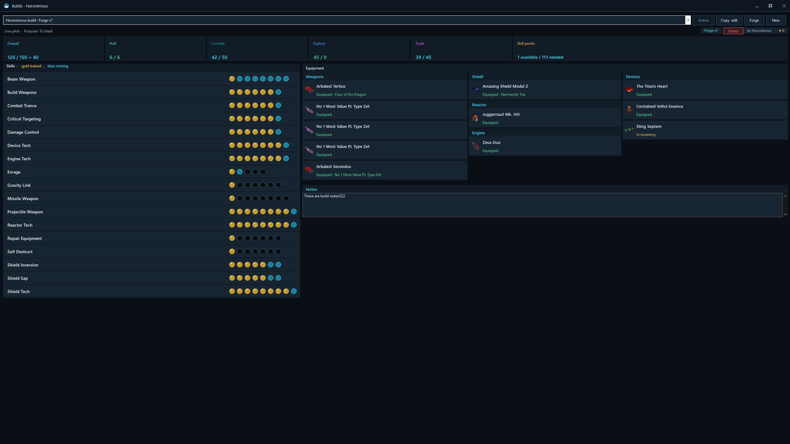
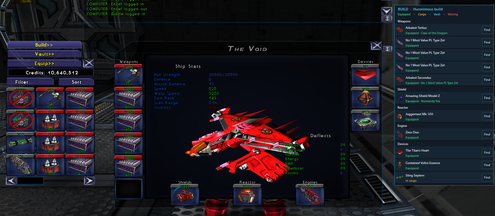
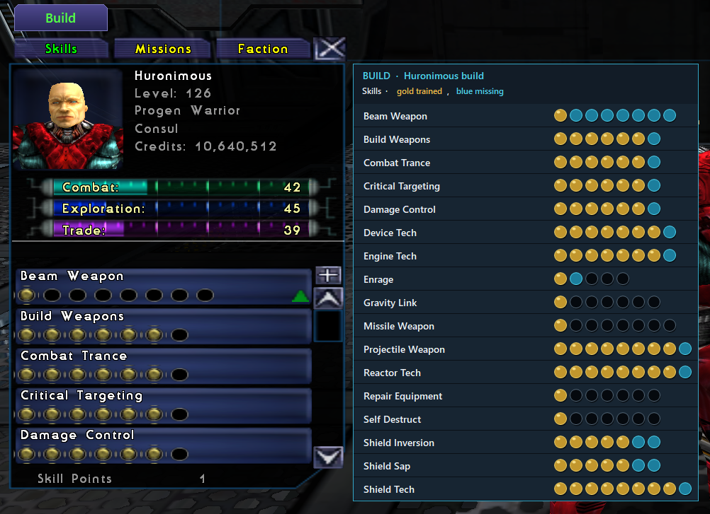
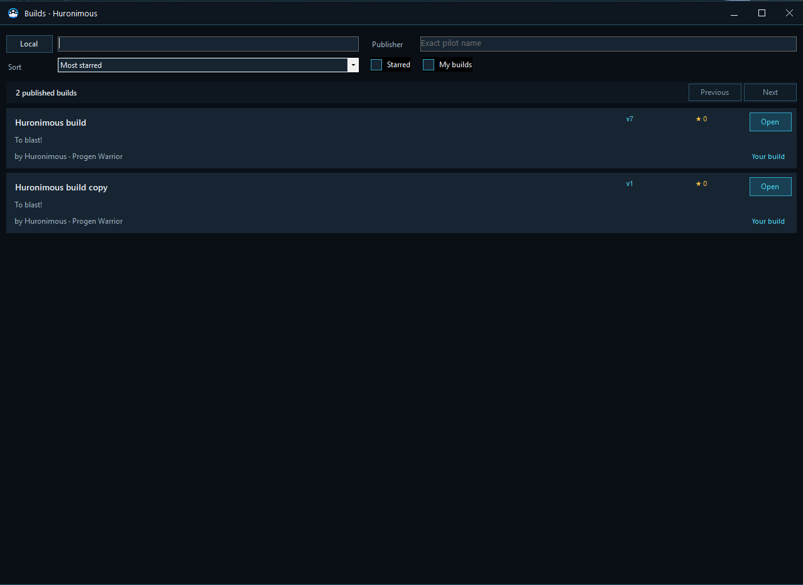

# Builds

Builds turn an equipment idea into a reusable plan: what to fit, which skills are required, which ranks are recommended, what the pilot already owns, and what remains to be found.

## Open the Build Board

Open **Builds** from the in-game Client Manager menu or from a pilot in the Pilot Archive.

A build belongs to a profession. The board compares the build with the selected pilot’s current or archived state and reports the pilot’s levels, hull, available skill points, skills, equipment, and ownership.

## Create a build

A new build can begin:

- From the pilot’s currently observed equipment.
- From the latest equipment stored in the Pilot Archive.
- Empty, for a clean design.
- From a build found on Net7 Forge.

Give it a name, purpose or summary, and notes. These fields also make published builds easier to discover.

Local builds can be selected, edited, duplicated, deleted, and marked as the pilot’s active build.

## Levels, hull, and skill points

The board calculates minimum requirements from the chosen equipment and skills. It can show required Overall, Combat, Explore, and Trade levels, hull requirements, and whether the pilot has enough skill points for the complete plan.

All relevant skills remain visible in a consistent alphabetical view. Each skill can show:

- Current rank.
- Minimum required rank.
- Author-recommended rank.
- Final target rank.
- Skill-point cost.

Prerequisite skills are included automatically when the plan needs them. Select a rank to change the recommendation rather than editing hidden dependency math.

## Equipment plan

Plan weapons, shield, reactor, engine, and device slots within the profession and hull limits of the selected pilot. Invalid race or profession equipment is blocked, and the board warns when too many slots are filled.

Each position can have a primary item and alternatives. Use the equipment picker to search suitable items and inspect restrictions and effects.

Ownership is reported in the player’s language:

- **Equipped**
- **In inventory**
- **In vault**
- **Missing**

When an item is missing, open it in Galaxy Finder to inspect known sources or add it to a shopping list.

## Active build companions

When a pilot has an active build, small contextual companions can appear beside the native game panels.

### Equipment companion

The equipment companion lines up the active build with the pilot’s currently equipped items. It highlights matching, alternative, available, and missing choices and can open Galaxy Finder for a missing item.

### Skills companion

The skills companion appears beside the Skills panel. It compares current ranks with required and recommended ranks and opens the complete Build Board when more detail is needed.

The Show/Hide choice is remembered independently for the relevant game area.

## Find builds on Net7 Forge

The Forge browser searches build names, purposes, notes, and publishers. Filters include starred builds and your own builds. Results can be sorted by relevance, most starred, newest, or name.

A build detail page shows the publisher, profession, summary, stars, versions, skills, equipment, and notes. A build for another profession can be viewed but not applied to the selected pilot.

Star useful builds to make them easier to find later.

## Versions and updates

Forge releases are immutable. Publishing a correction or improvement creates a new version rather than changing the release someone already chose.

A pilot stays on the exact version selected. When a newer version exists, the board shows that an update is available and leaves the decision with the player.

Stars belong to the logical build across its versions.

## Publish a build

Publishing uses a logged-in pilot as the public publisher. The first release establishes the public build identity; later releases add immutable versions.

Before publishing another player’s build as your own variation, use **Copy & edit**. This preserves the original release while giving the new build its own identity and notes.

Because published releases are permanent records, review the profession, equipment, skill recommendations, summary, and notes before completing publication.
