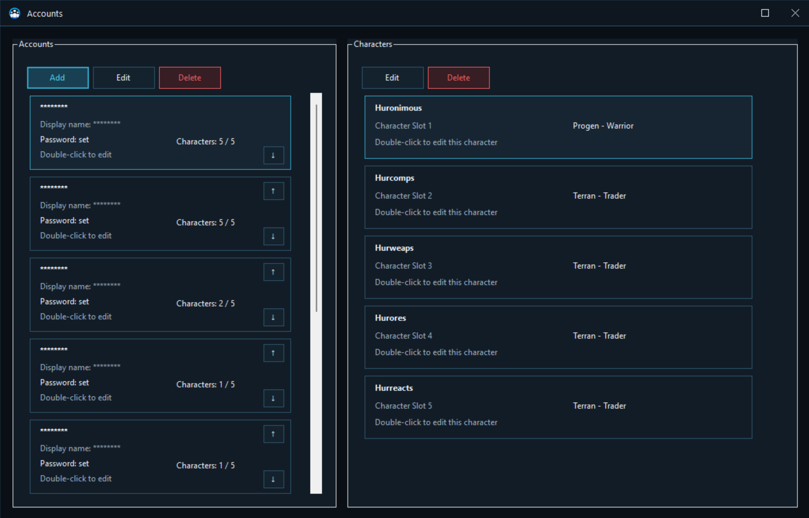
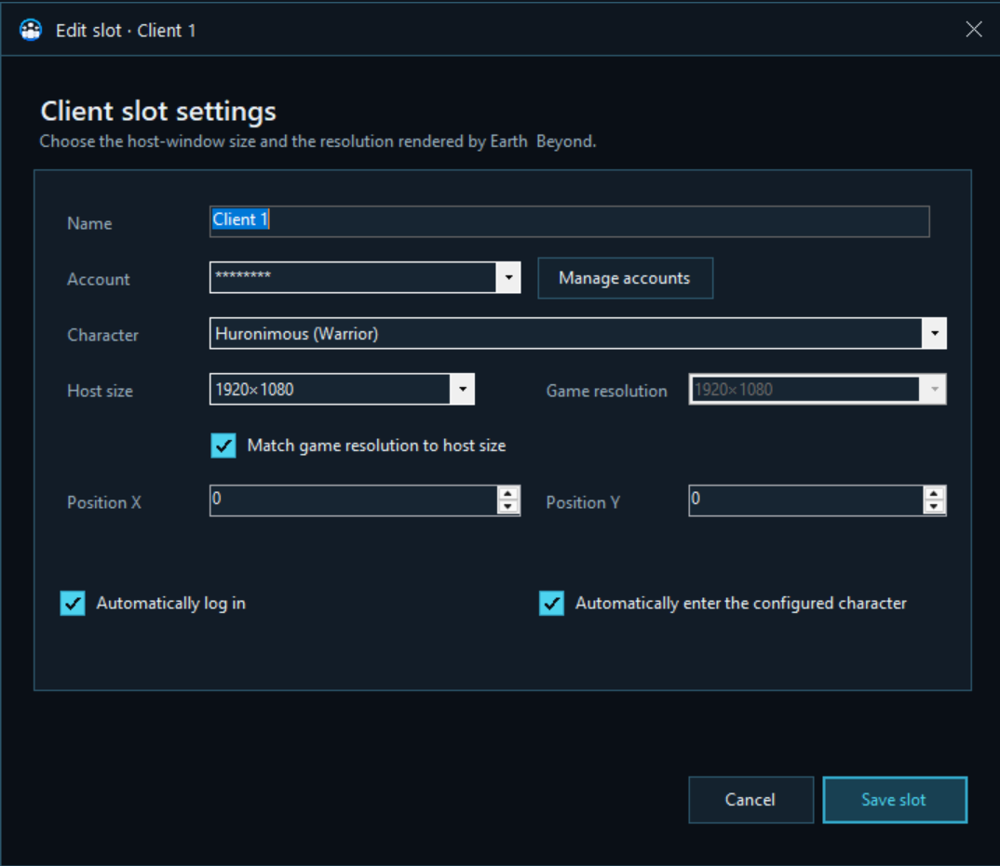
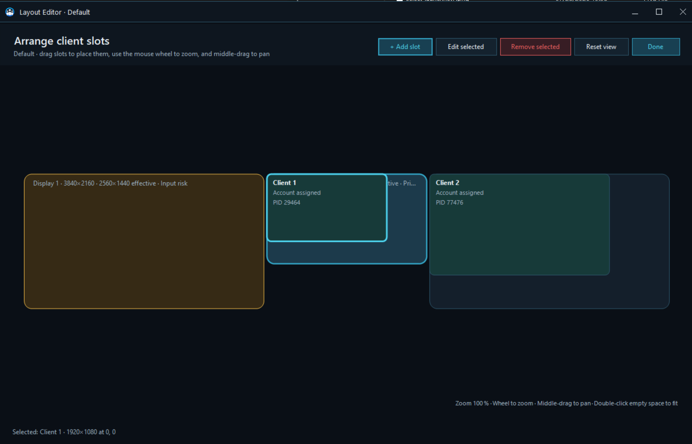

# Preparing your fleet

A little preparation turns repeated login choreography into a launch sequence.

## Accounts and pilots

Open **Accounts & tools → Manage** from the main screen.

The Accounts window keeps a friendly display name, the real Net-7 login name, an optional protected password, and up to five pilot entries for each account.

### Add an account

Select **Add**, then enter:

- **Display name:** the label shown inside Net7 Client Manager.
- **Login name:** the account name used by Earth & Beyond.
- **Password:** optional, used only when automatic login is enabled for a slot.

Leaving the password field empty keeps the existing protected password when editing an account. **Clear stored password** removes it.

Passwords are stored for the current Windows user rather than as readable text.

### Add pilots

Select an account and use the Characters area to add or edit its pilots. Each pilot has a name and one of the nine playable race and profession combinations:

- Jenquai Defender, Explorer, or Seeker.
- Progen Sentinel, Warrior, or Privateer.
- Terran Enforcer, Trader, or Scout.

The order matches the account’s five pilot positions. The up and down controls let you correct the saved order when needed.

Deleting a saved pilot only removes the manager’s entry. It does not delete anything from the game account.

## Profiles

A **profile** is a reusable fleet arrangement. Only one profile is active at a time, and changing profiles immediately applies the newly selected layout to suitable running clients.

The Profile card provides four actions:

- **New** creates an empty profile.
- **Rename** changes its label.
- **Duplicate** copies the entire layout, useful for making a variation.
- **Delete** removes the selected profile after confirmation.

Profiles are ideal for different activities: a combat group, a trade convoy, a mining crew, a compact laptop layout, or a full multi-monitor command deck.

## Client slots

A **client slot** describes one place in the active profile. Select **+ Add slot**, or open **Edit layout** and add one from the layout canvas.

Each slot can contain:

- A recognizable slot name.
- A saved account and pilot.
- The size of the hosted game window.
- The resolution rendered by Earth & Beyond.
- Its X and Y position in the overall layout.
- Automatic login.
- Automatic entry with the configured pilot.

### Host size and game resolution

**Host size** controls how much desktop space the client occupies. **Game resolution** controls what Earth & Beyond renders inside that host.

Enable **Match game resolution to host size** for a simple one-to-one setup. Disable it when you deliberately want a different game resolution inside the available host area.

This choice belongs to each slot, so a fleet can mix compact support clients with a larger main pilot.

### Automatic login and pilot entry

A slot can:

- **Automatically log in** using the selected account and its stored password.
- **Automatically enter the configured character** after login.

Automatic pilot entry depends on automatic login and a saved pilot. Slots that share the same account are prevented within one profile because Net-7 cannot keep the same account logged in twice.

### Position warning for left-side monitors

Earth & Beyond can reject simulated input when its hosted window occupies a monitor with a negative horizontal coordinate, commonly a screen placed to the left of the primary monitor.

The manager allows this arrangement but shows a warning. When login or fleet controls behave strangely on such a screen, move that slot to the primary monitor or to a monitor positioned to its right.

## The layout editor

Select **Edit layout** to arrange slots visually.

- Drag a slot to move it.
- Use the mouse wheel to zoom.
- Hold the middle mouse button and drag to pan across a large desktop.
- Select a slot and use **Edit selected** to change its settings.
- Use **Remove selected** to remove it from the profile.
- Double-click empty space or use **Reset view** to bring the layout back into view.
- Select **Done** when the fleet fits.

Deleting an occupied slot does not lose the running client. The game remains hosted as an unassigned client and can be placed again later.

## Keep the profile healthy

The Client slots panel offers two useful fleet-level actions:

- **Create missing** starts each configured slot that is not currently represented by a running client.
- **Keep alive** maintains the active profile by starting missing clients as needed.

Use **Create missing** for a one-time launch. Use **Keep alive** when the active profile should remain complete throughout the session.
