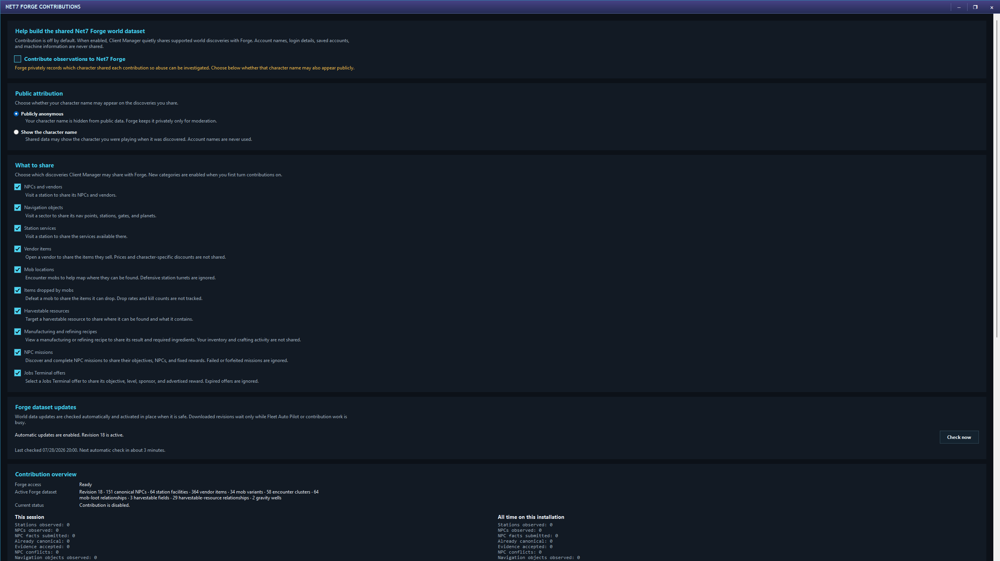

# Forge Contributions

Forge Contributions let players improve shared galaxy knowledge by donating selected observations already seen during ordinary play. The feature is off by default.

## What is not shared

Contribution uploads do not include:

- Account login names.
- Stored passwords.
- Saved account records.
- A general inventory of the computer.

Each category is limited to the galaxy observation it describes.

## Attribution

Choose how public contributions appear:

- **Publicly anonymous** hides the pilot name from public attribution.
- **Show character name** credits the contributing pilot.

Forge retains the contributing pilot privately where needed for moderation, abuse handling, and recovery, even when public attribution is anonymous.

## Contribution categories

Enable only the categories you are comfortable sharing. When contributions are enabled for the first time, newly introduced categories begin enabled so they are visible and can be reviewed:

### NPCs and vendors

Known NPC or vendor identity and location.

### Navigation objects

Observed gates, stations, navigation points, planets, accelerators, and their useful map properties.

### Station services

Services observed at a station.

### Vendor items

Items offered by a vendor. Prices and personal discount results are not contributed.

### Mob locations

Observed mob identity and location. Defensive station turrets are ignored.

### Items dropped by mobs

Observed loot relationships. Kill counts and calculated drop rates are not contributed.

### Harvestable resources

Observed resource fields and harvestable items.

### Manufacturing and refining recipes

Observed recipe relationships. Personal inventory and crafting activity are not uploaded as a shopping history.

### NPC missions

Observed mission objectives, NPCs, and fixed rewards. Failed and forfeited missions are ignored for contribution purposes.

### Jobs Terminal offers

The selected offer’s objective, level, sponsor, and advertised reward. Expired offers are ignored.

## Data updates

Contribution support also receives shared navigation and galaxy-data revisions. New data is downloaded and activated automatically when safe. Activation waits when Auto Pilot or contribution processing is in the middle of work rather than changing the map beneath an active action.

The window shows the active data revision, current status, pending activation, and manual **Check now** control.

## Statistics

Session and lifetime counters show what was observed, prepared, uploaded, accepted, ignored, or rejected. **Reset session counters** clears only the current-session display, not Forge history or lifetime totals.

## Reconnect an existing Forge profile

When moving to another installation or recovering local state, select a currently running pilot and choose **Use my existing Forge profile**. The manager creates a recovery code. Use **Copy message for Huron**, send that message to Huron privately on the official Net-7 forums, and use **Check again** after approval. The code and pilot name are never posted publicly by the manager.

## Why contributions matter

Shared observations improve:

- Galaxy Atlas labels, services, encounters, resources, and routes.
- Galaxy Finder sources and item relationships.
- Shopping-list acquisition plans.
- Mission and Jobs Terminal destination recognition.
- The experience of players who have not personally visited every corner of the galaxy.

Contribution is always a choice. The rest of Net7 Client Manager continues to work with bundled and locally observed data when contribution is disabled.
