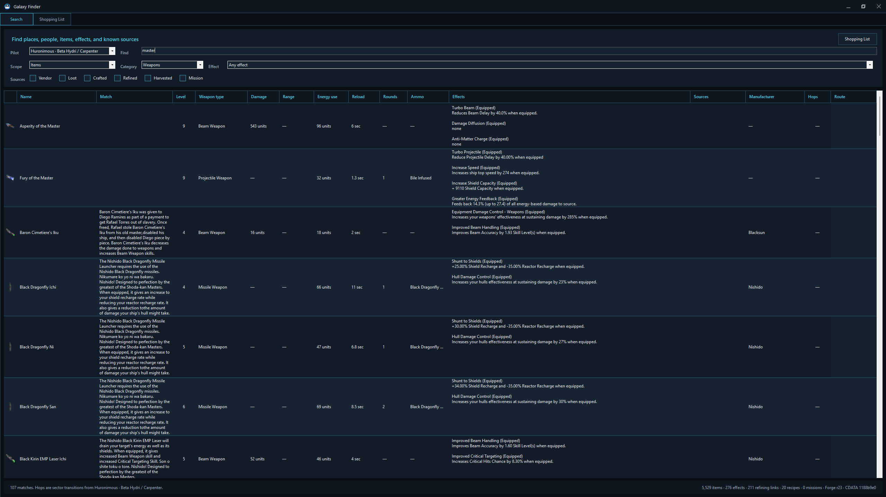
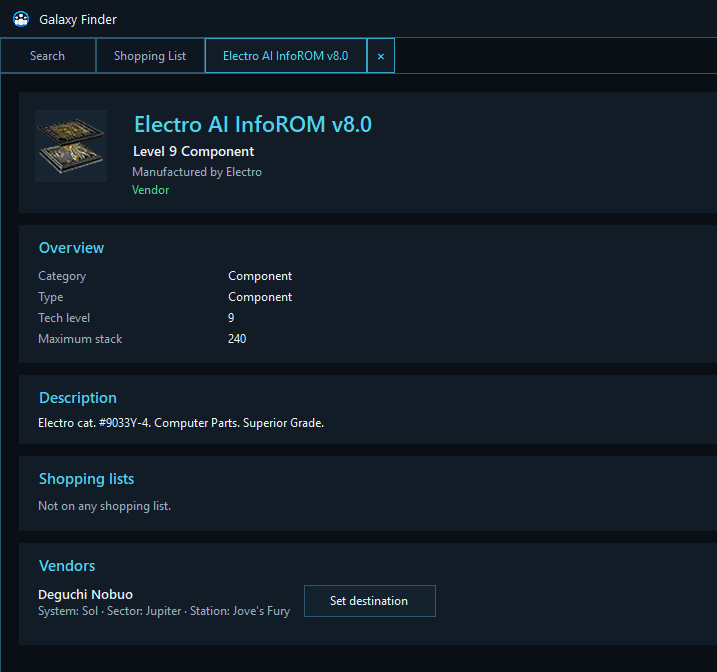
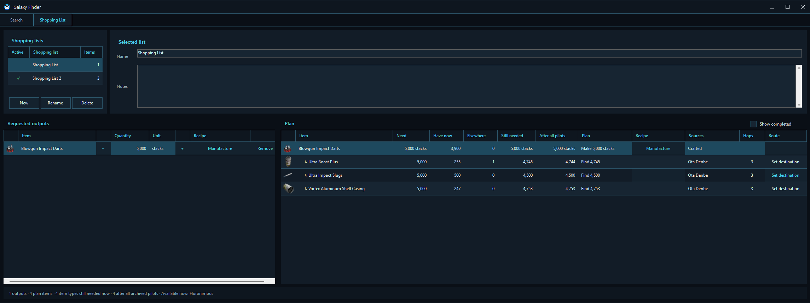
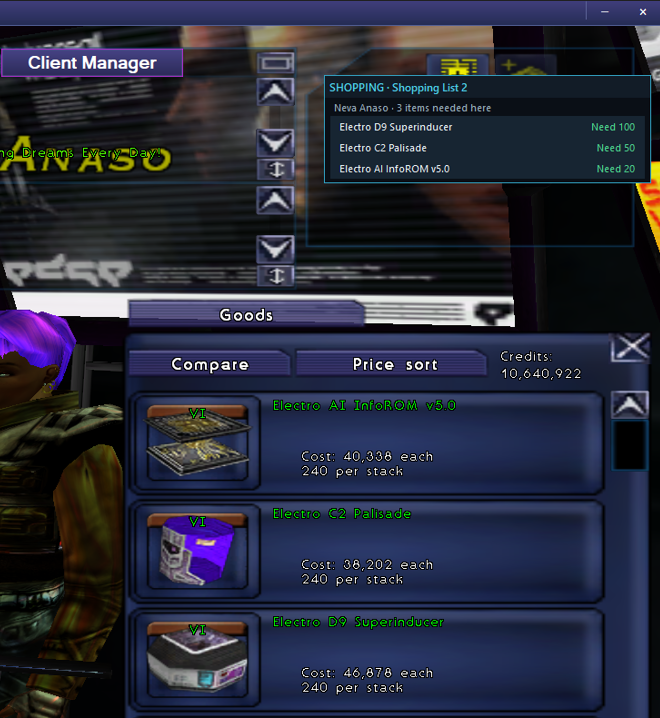

# Galaxy Finder and shopping lists

Galaxy Finder is the galaxy’s searchable quartermaster, cartographer, directory, and recipe book in one window.

## What can be found

Search across:

- **All** known entries.
- **Places** such as systems, sectors, stations, gates, planets, and navigation points.
- **NPCs** and vendors.
- **Mobs** and their known locations.
- **Harvestables** and resource fields.
- **Items**, equipment, components, resources, ammunition, trade goods, and other cargo.

The search accepts names, manufacturers, effects, sources, places, NPCs, mobs, and harvestables.

Selecting a hosted or archived pilot allows Finder to calculate hop counts from that pilot and to describe a mob’s likely disposition toward them when enough faction information is available.

## Item categories and source filters

Item searches can be narrowed to:

- Equipment
- Weapons
- Engines
- Shields
- Reactors
- Devices
- Ammunition
- Components
- Raw resources
- Mob loot
- Refined materials
- Trade goods
- Other items

Source filters include vendor, loot, crafted, refined, harvested, and mission sources.

Results use columns suited to the chosen category. An engine search can emphasize thrust and warp behavior, while a shield search emphasizes capacity and recharge. Item effects are shown as readable lines rather than buried in a generic description.

## Item and place details

Open a result to see its detailed page. Depending on what is known, an item page can show:

- Name, icon, level, category, and manufacturer.
- Profession or race restrictions and other requirements.
- Equipment statistics.
- Activated and equipped effects.
- Description and catalog notes.
- Vendors and their stations.
- Mobs that drop it and their sectors.
- Harvest fields.
- Mission reward sources.
- Manufacturing and refining relationships.
- What the item is used to make.

Sources with a known location include route information and **Set destination**.

With **Keep Search open in its own tab** enabled, detail pages open beside the permanent Search tab. With it disabled, Finder uses a simpler detail-and-back flow.

## Shopping lists

A shopping list begins with the outputs you want to obtain. Quantities mean **additional items to acquire**, not a desired total across your existing stores.

Open **Shopping List** to:

- Create, rename, or delete lists.
- Add notes.
- Mark one list as active.
- Add requested outputs and quantities from search results.
- Work in individual items or full stacks where appropriate.
- Show or hide completed plan lines.

### Recipes and expansion

When an output can be manufactured or refined, expand it into ingredients. Where several recipes exist, choose the recipe to use. The plan can continue through multiple levels of ingredients.

For ammunition, one manufacturing run produces one full stack of that ammunition. The number of rounds in a stack follows the item’s own stack size.

### What the plan knows

The planner compares the recipe with the selected pilot’s live cargo and the latest Pilot Archive information for all pilots. Plan lines can distinguish:

- What is needed.
- What is available now on the selected pilot.
- What exists elsewhere in the fleet.
- What is still missing now.
- What would remain missing after all archived holdings are considered.

Existing ownership helps satisfy ingredient needs, but it does not silently erase the requested root outputs. Asking for three new reactors still means obtaining three reactors, even when one already sits in a vault.

### Sources and routes

Plan lines show known source summaries, hop counts, and route actions. Use **Set destination** to travel to a suitable vendor, mob, harvest field, or other source.

## Vendor shopping companion

When the active shopping list needs goods sold by the vendor currently open in Earth & Beyond, a compact companion appears above the vendor tabs.

It shows only useful purchases from that vendor and reduces the remaining quantities as items arrive in the pilot’s cargo. It hides when the vendor closes or nothing on the active list can be bought there.

Enable or disable this behavior in **Client Manager → Options → Galaxy Finder**.
