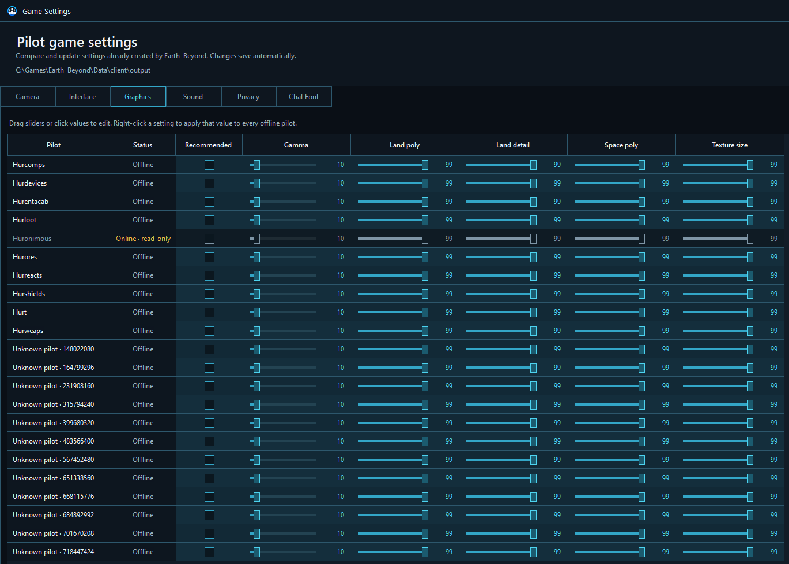
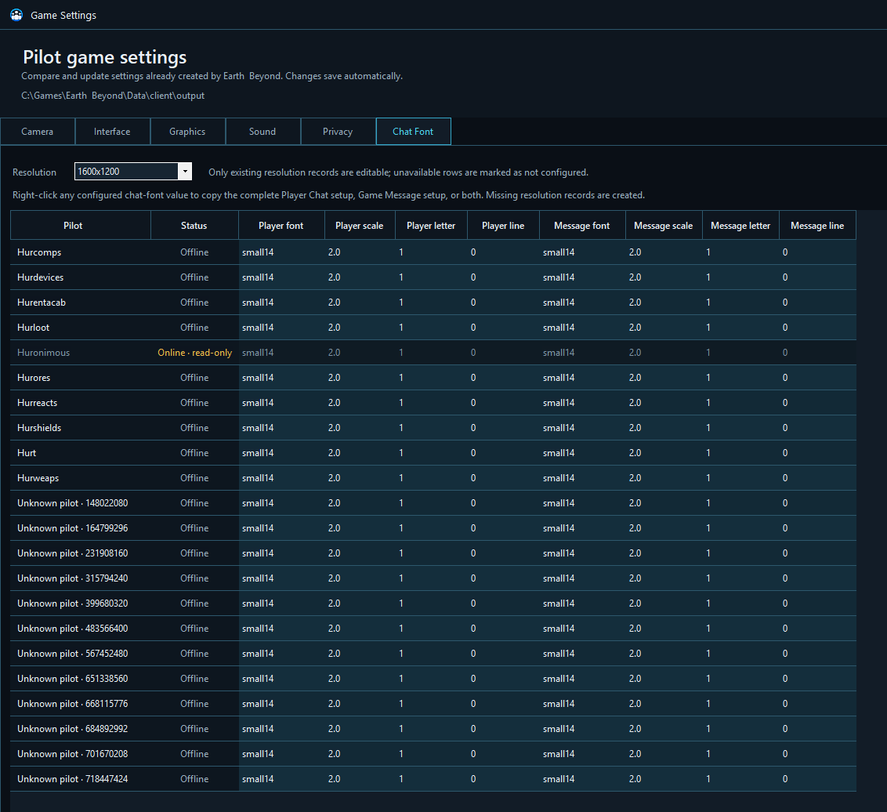

# Game Settings

Game Settings compares the Earth & Beyond options already created for your pilots and lets you copy or adjust them without visiting every pilot one by one.

Open **Accounts & tools → Game Settings** from the main screen.

## How changes work

The window reads each pilot’s existing Earth & Beyond settings. Changes save automatically.

Only offline pilots are edited. A running game client remains authoritative and is not rewritten underneath the player.

Use **Reload from game** after changing settings inside Earth & Beyond or after another pilot creates new option records.

A setting marked **not configured** does not yet exist in that pilot’s game files. The editor avoids inventing ordinary option rows that Earth & Beyond has never created.

## Apply a value across pilots

Right-click a configured value to apply it to every eligible offline pilot. This turns a carefully tuned main pilot into a template without requiring a separate export format.

The exact right-click action follows the setting type: toggle, slider, or choice.

## Camera

Compare the camera behavior used during:

- Normal flight and keeping the ship visible.
- Looting.
- Landing.
- Bridge view.
- Warping.
- Gating.
- Docking.

These values help prevent support clients from adopting wildly different camera movement during the same fleet action.

## Interface

Adjust interface values already present for a pilot, including tooltip delay.

## Graphics

Compare and tune the game’s existing graphics controls, including the recommended preset, gamma, land polygon and detail settings, space polygon detail, and texture size.

A support client can use lighter graphics while a primary pilot keeps the richer view.

## Sound

Compare sound choices such as Doppler, music, effects, and dialog. Bulk application makes it easy to mute support clients while preserving full sound on the main pilot.

## Privacy

Set **Who can see me online?** to the available Earth & Beyond privacy choices, such as everyone or friends only. Right-click to apply the selected privacy value to other offline pilots.

This native game privacy setting is separate from Net7 Client Manager’s optional Social presence and Atlas visibility.

## Chat Font

Chat font settings are stored per game resolution. Choose a resolution to compare Player Chat and Game Message records, including font, scale, letter spacing, and line spacing.

Only existing records are directly editable. Right-click a configured font value to copy:

- The complete **Player Chat** setup.
- The complete **Game Message** setup.
- Both complete setups.

Unlike ordinary option rows, this copy action can create a missing resolution record for another offline pilot. That makes it possible to standardize chat readability before opening every pilot at that resolution.

