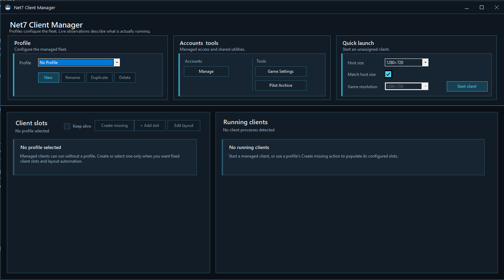
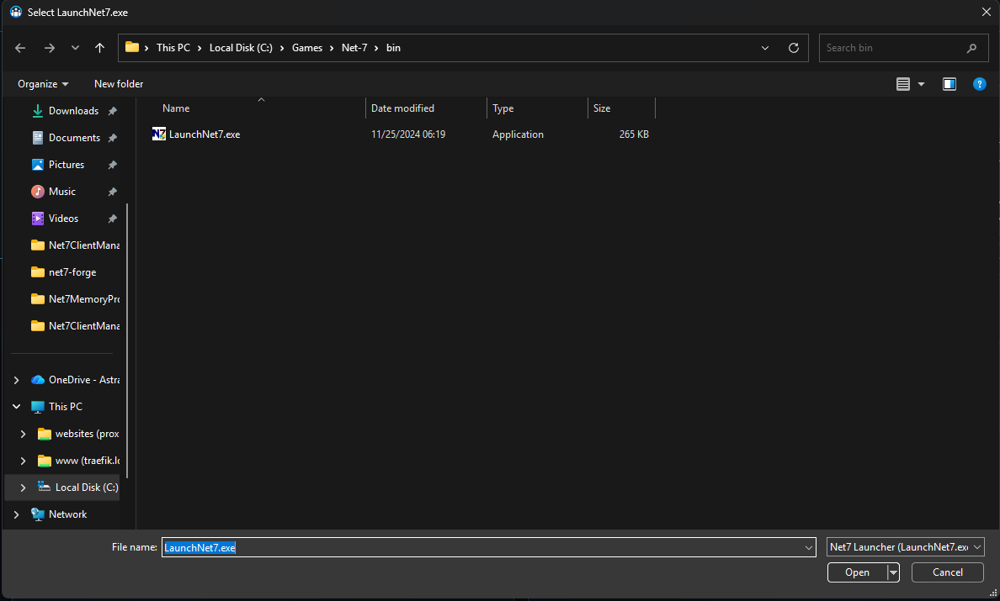

# Install and first launch

## Before you begin

Net7 Client Manager is a Windows companion for an existing Earth & Beyond / Net-7 installation. The current release package is built for 64-bit Windows and includes what it needs to run.

You should already be able to start the game through **LaunchNet7.exe** before introducing the manager.

## Install the manager

1. Download the Windows release archive from the project’s GitHub Releases page.
2. Extract the complete archive to a normal folder. Do not run it from inside the ZIP file.
3. Start `Net7ClientManager.exe`.

The manager keeps its own settings and observations between sessions. Updating to a newer version does not require rebuilding your profiles, accounts, archive, shopping lists, builds, or add-on choices.

## The first screen

On first launch, the manager creates an empty **No Profile**. The main screen is divided into three areas:

- **Profile** selects and manages reusable fleet layouts.
- **Accounts & tools** opens account management, game settings, and the Pilot Archive.
- **Quick launch** starts a client that is not tied to a profile slot.

Below those cards are **Client slots** and **Running clients**.

## Find the Net-7 launcher

The first time you start a client, Net7 Client Manager tries to find `LaunchNet7.exe`. When it cannot, it opens a file picker titled **Select LaunchNet7.exe**.

Select the launcher from your Net-7 installation. The manager remembers this location for later launches.

When a launch is requested, the manager:

1. Opens the Net-7 launcher, or uses the already open launcher.
2. Waits for launcher checks and updates to finish.
3. Activates **Play**.
4. Waits for the new Earth & Beyond client.
5. Hosts the game window and applies the requested size and placement.

A profile slot can continue through account login and pilot selection when those options are enabled. A Quick launch client stops at the normal game screens so you can choose the account and pilot yourself.

## Let the manager host existing clients

Net7 Client Manager also notices Earth & Beyond clients that were started outside the manager. It brings their windows into the management surface and shows them under **Running clients**.

When a suitable free slot exists, the manager assigns the client to it. Extra clients remain safely hosted as **unassigned** clients until a slot becomes available.

## Close the application

Closing a hosted game window closes the corresponding Earth & Beyond client rather than leaving an invisible `client.exe` behind. Closing Net7 Client Manager ends the management session and closes its hosted windows.

## Next step

Continue with [Preparing your fleet](fleet-setup.md) to save accounts, pilots, profiles, and layouts.
