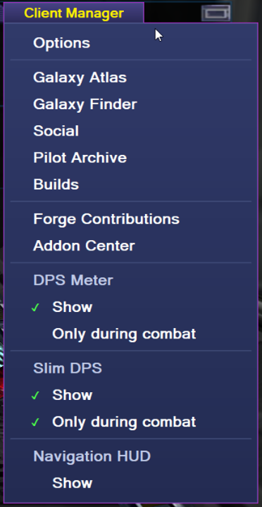
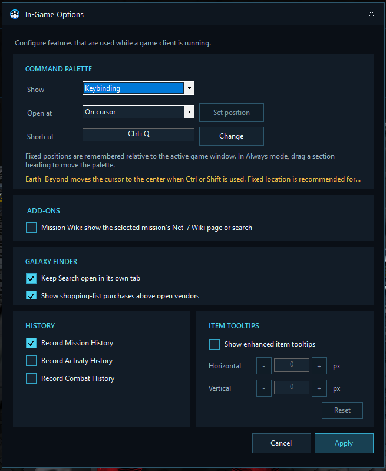
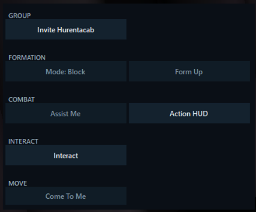
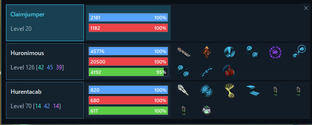
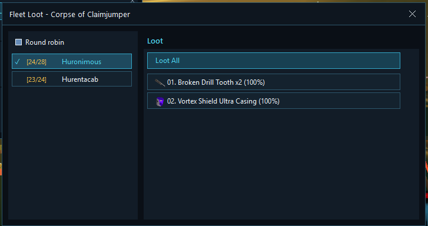

# The in-game Client Manager

Once a hosted pilot reaches the game, Net7 Client Manager adds a **Client Manager** tab to the game interface. This is the launchpad for built-in tools and installed add-ons.

## Built-in entries

The menu contains:

- **Options**
- **Galaxy Atlas**
- **Galaxy Finder**
- **Social**
- **Pilot Archive**
- **Builds**
- **Forge Contributions**
- **Addon Center**

Installed add-ons can add their own sections, buttons, toggles, and windows beneath the built-in entries.

Built-in and add-on windows remember their position for the relevant client or slot. Many can be dragged, minimized, restored, or closed without affecting the game.

## Options

The in-game Options window controls features that belong close to the game rather than to one archived pilot.

### Command Palette

The Command Palette gathers fleet actions into a compact overlay. Its visibility can be:

- **Never:** do not show the palette.
- **Always:** keep it open while the pilot is in game.
- **Keybinding:** show it while the chosen shortcut is held.

For Keybinding mode, choose whether the palette opens **On cursor** or at a **Fixed location**. Fixed positions are remembered relative to the active game window. In Always mode, drag a section heading to reposition the palette.

The shortcut is checked against Earth & Beyond’s own controls to avoid an accidental collision.

### Mission Wiki

Enable **Mission Wiki: show the selected mission’s Net-7 Wiki page or search** to add contextual mission help. See [Mission help](navigation.md#mission-help).

### Galaxy Finder

- **Keep Search open in its own tab** retains the search page while item or place details open in additional tabs.
- **Show shopping-list purchases above open vendors** enables the contextual vendor companion.

### History

Choose which journals the manager records:

- Mission history.
- Activity history.
- Combat history.

Mission history is enabled by default. Activity and combat recording are opt-in because they can collect much more detail over time.

### Item tooltips

Enable enhanced Net7 Client Manager item tooltips and adjust their horizontal or vertical offset. **Reset** returns them to the recommended alignment.

Enhanced tooltips are used for native inventory, vault, loot, and equipped-item hovers, as well as many manager item lists. Vendor inventory and the native shortcut bar keep their normal game behavior.

## Command Palette actions

The palette is arranged into the Earth & Beyond activities players recognize:

- **Group**
- **Formation**
- **Combat**
- **Interact**
- **Move**

It combines detected game shortcuts with built-in fleet actions. Depending on the current pilots and controls, it can offer actions such as:

- Open the **Action HUD**.
- Invite another hosted pilot to the group and accept the invitation on that pilot.
- Remove a controlled pilot from the group.
- Interact with the current target across the fleet.
- **Assist Me**, making controlled group pilots take the main pilot’s target and fire.
- **Come To Me**, making controlled group pilots target and warp toward the main pilot.
- **Form Up** or **Break Formation**.
- Change formation between **Block**, **Slot-Back**, and **Pipe**.
- Select the nearest navigation point or the previous target when a feature needs those actions.
- Run available skills, items, equipment actions, movement commands, and combat shortcuts across suitable pilots.

After a fleet sequence, control is returned to the pilot who invoked it.

Only actions that can be identified safely are offered. The exact list therefore follows the active pilot’s shortcuts and the state of the controlled clients.

## Action HUD

The **Action HUD** is a live fleet control window. It shows each controlled in-game pilot, the target they see, and compact shield, hull, reactor, group, level, and readiness information.

Actions are grouped by skills, equipment, items, or game shortcuts. The HUD explains why an action is unavailable, including cooldown, range, reactor energy, target relationship, ammunition, or another busy state.

Combat actions include guarded **Fire All** behavior rather than an unconditional key broadcast. The HUD checks that the selected target and pilot state make sense before acting.

## Fleet Loot

Select **Loot** from the Action HUD to open **Fleet Loot** for the currently observed corpse.

The window shows:

- The items observed on the corpse.
- The selected looter.
- Cargo usage and capacity.
- A per-item loot action.
- **Loot All**.
- **Round robin** selection for spreading loot across the fleet.

Because Earth & Beyond transfers loot one item at a time, the window follows the corpse and cargo changes as they happen.

## Contextual helpers

Some tools appear only beside the game screen that gives them meaning:

- Route details beside a selected Jobs Terminal offer.
- Mission Wiki controls beside the mission journal.
- A shopping companion while a relevant vendor is open.
- Equipment and skill build companions beside the matching game panels.
- Enhanced faction details over the native faction-detail area.

These helpers hide again when their source panel closes, so the game screen does not accumulate permanent barnacles.
