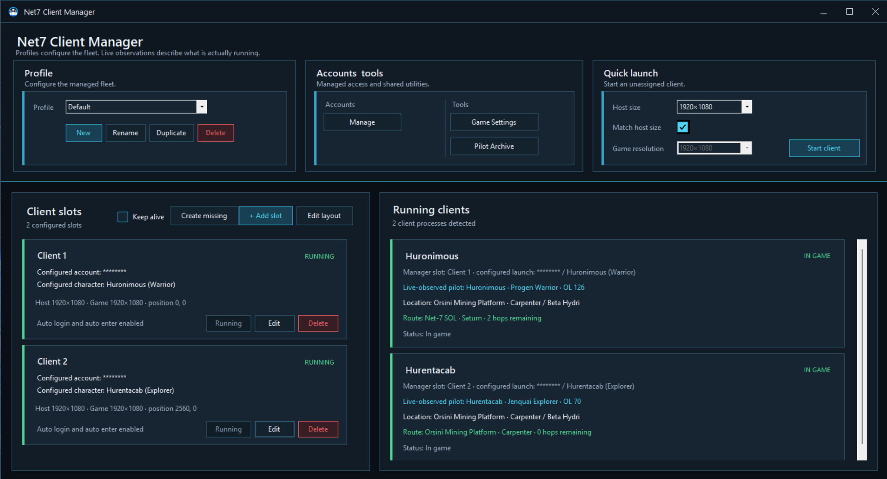

# Net7 Client Manager

**One home port for every Earth & Beyond client.**

Net7 Client Manager helps you launch, arrange, identify, and operate several Earth & Beyond pilots without turning your desktop into a drifting field of overlapping game windows. It also adds a growing set of in-game tools for navigation, item research, build planning, pilot history, fleet actions, social discovery, add-ons, and community data.

## What it does

At its heart, Net7 Client Manager gives every game client a berth. A **profile** describes the arrangement you want, while **client slots** describe the size, position, account, and pilot expected in each berth. The manager can start missing clients, guide them through login and pilot selection, host their game windows, and restore the same layout next time.

Once a pilot enters the galaxy, an in-game **Client Manager** menu opens the rest of the toolbox:

- **Galaxy Atlas** for browsing the galaxy and seeing pilots, stations, resources, encounters, and known routes.
- **Galaxy Finder** for finding places, NPCs, mobs, harvestables, equipment, components, recipes, and sources.
- **Pilot Archive** for viewing the latest known state and recorded history of every observed pilot.
- **Builds** for planning equipment and skills, checking what you already own, and sharing builds through Net7 Forge.
- **Social** for public presence, looking for a guild, and guild recruitment.
- **Addon Center** for installing, controlling, and creating in-game add-ons.
- **Forge Contributions** for optionally sharing useful galaxy observations with the community.

Along the way, smaller helpers appear where they are useful: route buttons at the Jobs Terminal, mission help beside the mission journal, shopping needs above vendors, build companions beside equipment and skills, enhanced item tooltips, fleet actions, and fleet looting.

## A good first journey

New captains can follow the guide in this order:

1. [Install and start Net7 Client Manager](getting-started.md).
2. [Create accounts, pilots, profiles, and client slots](fleet-setup.md).
3. [Launch and manage the fleet](running-your-fleet.md).
4. [Meet the in-game Client Manager](in-game-tools.md).
5. Explore the feature guides as needed.

Experienced captains can jump directly to the [complete feature index](feature-index.md).

## A note about observed information

Many tools learn from what a pilot actually sees in Earth & Beyond. The Pilot Archive, route helpers, item sources, histories, and contextual windows become richer as the manager observes more play sessions. A blank field usually means **not observed yet**, not that the pilot or item lacks that property.

Information associated with a pilot is refreshed whenever that pilot is running. Previously observed information remains available while the pilot is offline.
