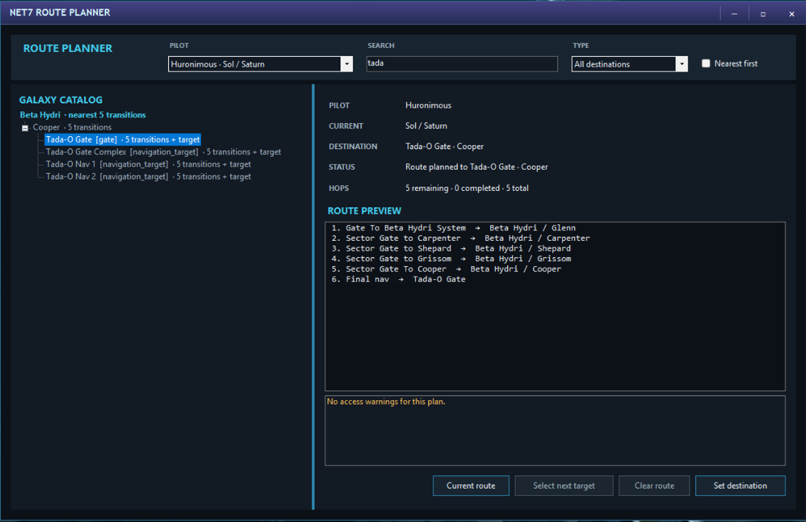
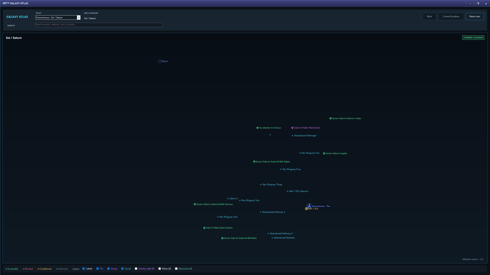
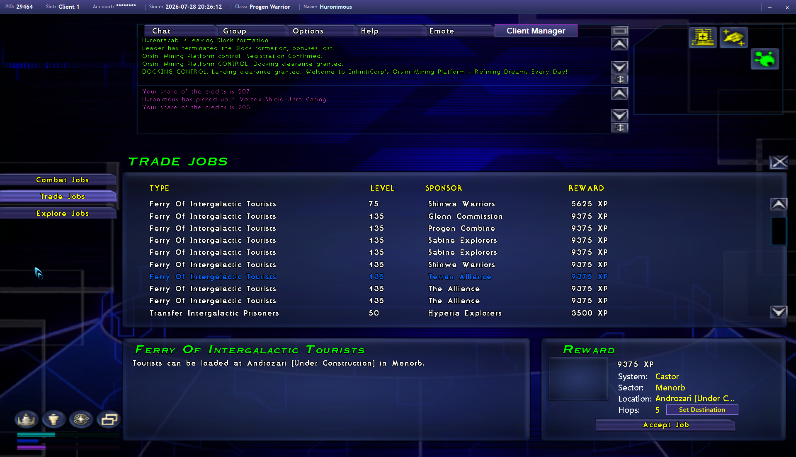
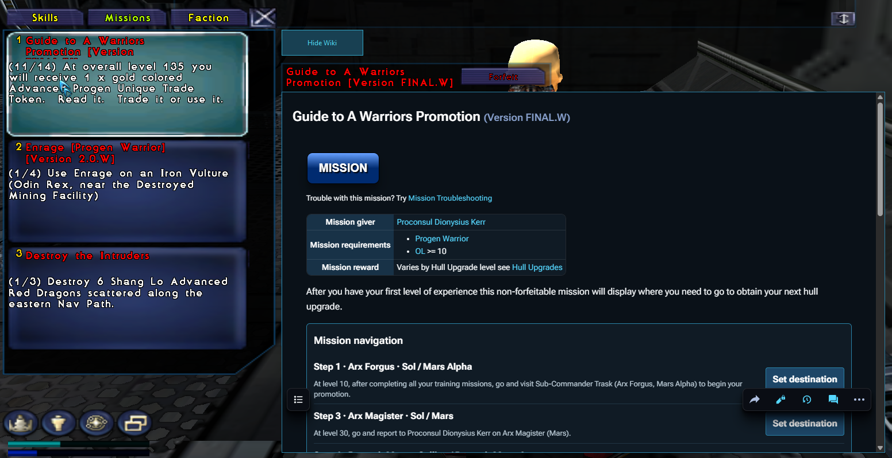
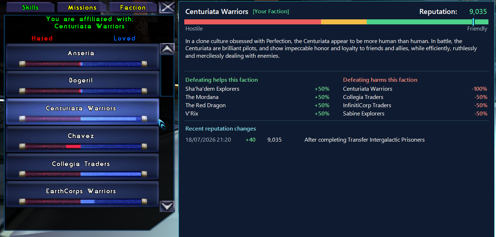

# Navigation and the Galaxy Atlas

Net7 Client Manager treats navigation as a shared journey. Destinations selected from the Atlas, Finder, Pilot Archive, Jobs Terminal, mission help, shopping plans, and build tools all feed the same route system.

## Route Planner

The Route Planner can be opened for a hosted pilot whenever a destination needs to be chosen.

### Find a destination

Search the galaxy catalog by ordinary text or narrow the search with a prefix:

- `system:`
- `sector:`
- `target:`
- `gate:`
- `station:`
- `planet:`
- `accelerator:`

Filter results to sectors, navigation points, stations, landable planets, gates, or accelerators. **Nearest first** favors destinations with the shortest known journey from the selected pilot.

The planner displays the current location, selected destination, route status, hop count, route preview, and any known access warning or condition.

### Group wormholes

Navigation treats learned **Create Wormhole** and **Extended Wormhole** destinations as shortcuts from the fleet's current sector. The route uses the combined skills of every managed pilot in the in-game group, so the selected pilot does not need to be the group leader or the wormhole caster.

For Auto Pilot, an eligible caster must place the relevant wormhole skill somewhere on either shortcut bank. The slot is not fixed: once the caster is in space, Client Manager finds the live shortcut, selects the required destination from the native menu, verifies the selection, invokes the skill, waits for the game to report that the wormhole is opening, and then accepts it for the managed group. Stations do not expose shortcut bars, so shortcut readiness is checked after undocking. Job Terminal journey counts use these same wormhole-aware route steps.

### Set and follow the route

Select **Set destination** to give the pilot the route. **Close after setting destination** makes this a one-action workflow.

The current route lists each step. **Select next target** asks the game to select the next relevant gate, navigation point, station, or landing target.

**Clear route** removes the destination without changing the pilot’s current target.

## Navigation presentations

Open **Navigation** from the in-game Client Manager menu. Navigation is built into Client Manager and can be used in two interchangeable ways:

- **In game** keeps a movable Navigation window over Earth & Beyond. Select **Pop out** when the game window needs more room.
- **Desktop companion** can sit beside or below Earth & Beyond, or move to another monitor. Select **Show in game** to return it to the hosted game.

Both presentations show the destination, next route target, completed and remaining hops, Auto Pilot state, warnings, and the same route controls. Moving between them does not restart the route or Auto Pilot. Their positions are remembered for the client slot.

The former Navigation HUD addon is retired. Client Manager uninstalls an installed copy automatically during upgrade and preserves the in-game choice for slots that had it enabled.

## Auto Pilot

A destination can be followed manually or from the built-in Navigation companion.

Auto Pilot works from the saved route rather than inventing its own journey. It can select route targets, warp, pass through gates or accelerators, use an eligible managed pilot's wormhole, dock at stations, and land on planets. It watches sector transitions, reactor energy, target changes, confirmations, and interruptions, and stops with an explanation when the next safe step cannot be completed.

The route remains associated with the pilot across ordinary window refreshes and sector changes.

Treat Auto Pilot as a travel assistant, not an invitation to abandon the bridge. Unexpected game messages, combat, blocked access, or changing galaxy conditions can still require the captain.

## Galaxy Atlas

The Galaxy Atlas is an interactive view of known sectors and their contents.

### Browse the galaxy

- Drag to pan.
- Use the mouse wheel to zoom.
- Search sectors, stations, navigation points, or pilots.
- Use **Back** to revisit the previous view.
- Reset the view or return to the selected pilot’s current location.
- Select connected gates to move between sector views.
- Right-click a routable object to set it as the destination.

The Atlas distinguishes locations that are accessible, blocked, conditional, or not yet understood. Conditional routes can include profession, faction, key, mission, or other access requirements known to the catalog.

### Layers

Toggle the information needed for the current task:

- **Labels**
- **Me**
- **Group**
- **Social**
- **Gravity wells**
- **Encounters**
- **Resources**

Pilot markers respect their chosen Social visibility. A pilot may share an exact position, a nearby navigation point, only the sector, or nothing at all.

### Location details

Selecting an object can reveal available coordinates, route actions, station services, NPCs, docked pilots, encounters, resources, and contribution gaps. Details depend on the active galaxy data and what players have observed.

## Jobs Terminal routes

When a Jobs Terminal offer is selected, a compact route panel appears alongside it when the destination can be identified. It shows the system, sector, location, and hop count, with **Set Destination** ready before the offer is accepted.

This is especially useful for comparing several jobs without repeatedly opening the map.

## Mission help

With Mission Wiki enabled, selecting a mission opens a reader-style Net-7 Wiki page when an exact page can be found, or a prefilled Wiki search when it cannot.

The mission helper recognizes locations mentioned by the page and adds route actions beside them. A **Mission navigation** section gathers recognized destinations so they can be sent straight to the Route Planner.

The helper steps aside while Earth & Beyond displays important confirmations, including mission-forfeit confirmation.

## Enhanced faction details

When the native faction detail panel is open, Net7 Client Manager can present a clearer faction view using the selected faction and observed pilot standing. It summarizes standing, reaction bands, related factions, thresholds, and known rewards or consequences where the available data supports them.

