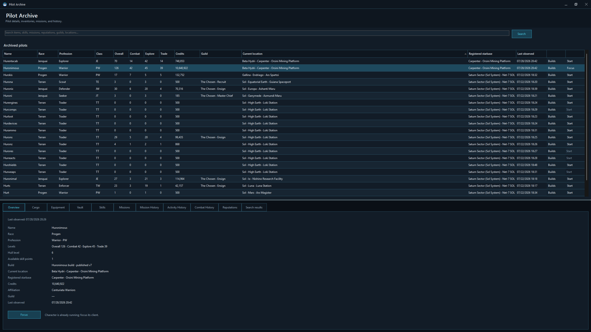
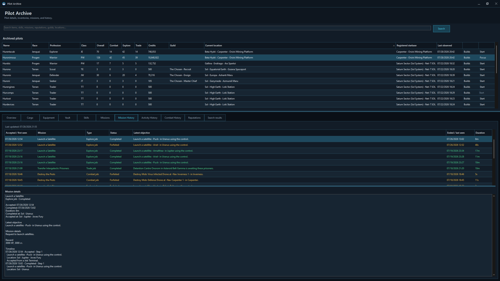
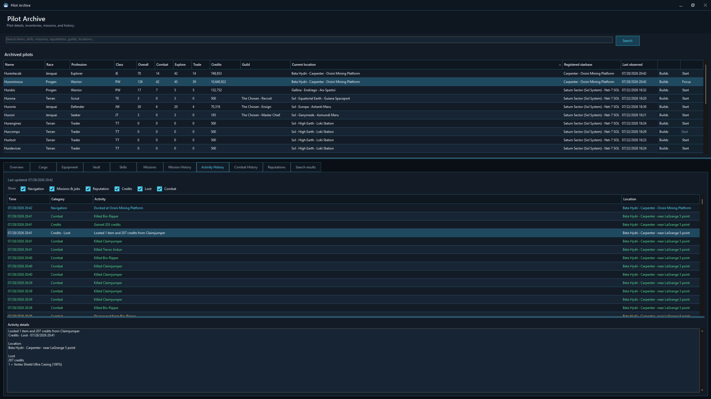
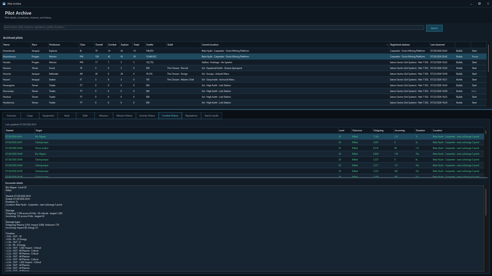
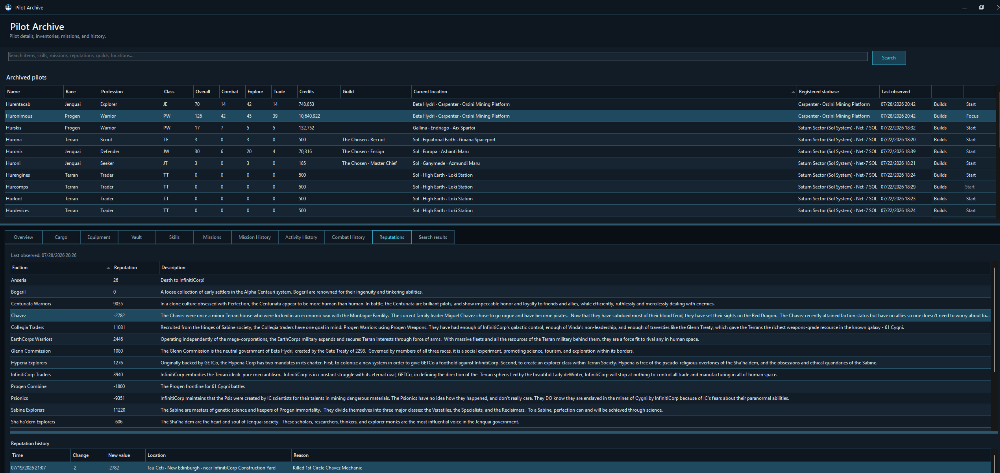

# Pilot Archive and histories

The Pilot Archive is the fleet’s logbook. It keeps the latest state observed for each pilot and, when enabled, records selected journeys through time.

## Archived pilots

The roster summarizes observed pilots, including identity, race, profession, levels, credits, guild, current location, registered starbase, last observation, build status, and launch availability where known.

Select a pilot to open the detail tabs. The information remains available while the pilot is offline and refreshes when they return to the game.

## Overview

The Overview tab collects:

- Name, race, and profession.
- Overall, Combat, Explore, and Trade levels.
- Hull level and available skill points.
- Active build.
- Current location and registered starbase.
- Credits, affiliation, and guild.
- Last observation time.

**Start character** launches the saved account and pilot directly when the account details are available.

## Cargo, equipment, and vault

These tabs preserve the latest observed contents, including slot, item kind or state, icon, item name, quantity, quality, structure, and builder where applicable.

Hover an item identity cell to open the richer item tooltip. The archive can therefore answer “which pilot has it?” without logging every character into the game.

## Skills

The Skills tab shows skill category, icon, skill name, rank, active state, and spent skill points. It feeds build comparisons and remains useful while the pilot is offline.

## Missions

The Missions tab shows the current mission journal, including mission name, stage, objective, and faction when available.

### Mission History

When mission history recording is enabled, the archive follows a mission from first sight to its ending. Entries can show:

- Accepted or first-seen time.
- Mission name and type.
- Current or final status.
- Latest objective.
- Ended or last-seen time.
- Duration.

Selecting an entry opens a detailed timeline with observed stages and, where available, issuer, accepted location, reward, failure consequence, and final outcome.

Mission history is enabled by default and can be changed under **Client Manager → Options → History**.

## Activity History

Activity history records a broader travel and progress journal when enabled. Filters can include:

- Navigation
- Missions and jobs
- Reputation
- Credits
- Loot
- Combat

Each line carries a time, category, activity, and location, with more detail in the lower pane.

## Combat History

Combat history records observed encounters when enabled. The encounter list can show start time, target, level, outcome, outgoing damage, incoming damage, duration, and location. Selecting an encounter reveals its available details.

## Reputations

The Reputations tab shows the pilot’s current observed standing with each faction and a description of that standing. Reputation history records observed changes with time, amount, new value, location, and reason when one can be identified.

## Search the entire fleet

The search bar looks across archived items, skills, missions, reputations, guilds, and locations. Results include the pilot and section where the match was found.

Double-click a result to open that pilot directly on the relevant tab.

This supports fleet questions such as:

- Who has this component?
- Which pilots know a particular skill?
- Where did I leave that mission?
- Which pilot is registered at this starbase?
- Who has standing with this faction?

## Open Builds

The build action opens the selected archived pilot in the Builds window. This allows equipment and skill planning even while the pilot is offline.
