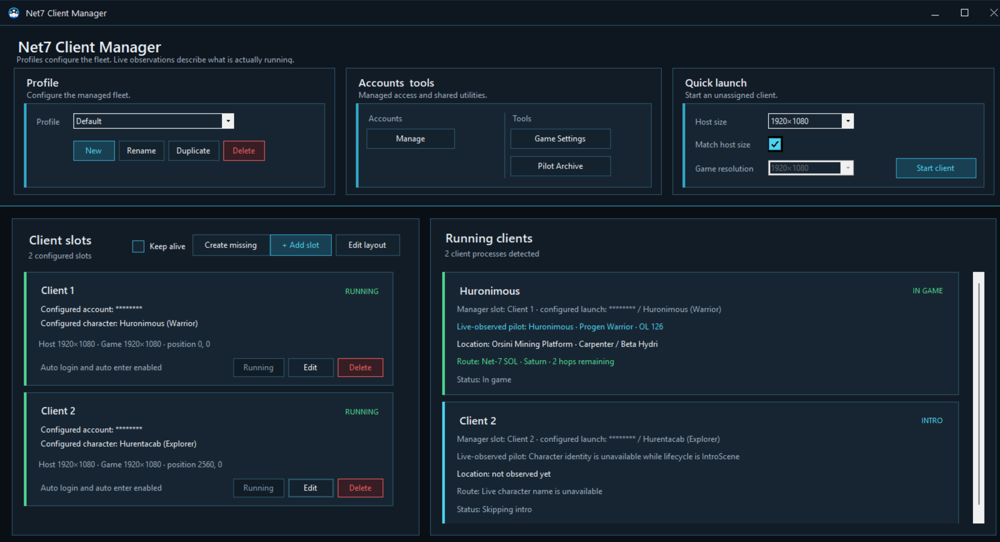

# Launching and managing your fleet

## Start a configured pilot

A configured slot can be started from its slot card. The manager opens the Net-7 launcher, waits for it to become ready, starts Earth & Beyond, places the window into the slot, skips the intro where possible, and performs the login steps enabled for that slot.

The running-client card reports where the launch currently is, such as starting the launcher, waiting for login, selecting a pilot, entering the game, or ready.

## Start a free client

Use **Quick launch** when the client should not occupy a configured slot.

Choose:

- **Host size**.
- Whether the game resolution should **Match host size**.
- A separate **Game resolution** when it should not match.

Select **Start client**. The client is hosted as **Unassigned client** and uses the normal account and pilot selection screens.

Quick launch is useful for a temporary pilot, account maintenance, testing a resolution, or bringing in a visitor that does not belong to the active fleet profile.

## Running-client cards

The Running clients area describes what truly exists, independently of what the profile expects. A card can show:

- The assigned slot, or that the client is unassigned.
- The saved account and pilot expected by the slot.
- The pilot actually observed in the game.
- Current location and route information when available.
- Launch and game state.

This distinction matters when a different pilot is selected manually or an existing game client is adopted by the manager. The profile remains the plan; the running-client card reports reality.

## Automatic assignment

When a new Earth & Beyond client appears, the manager looks for a suitable free slot. When no slot is free, the client stays hosted and unassigned.

Adding a slot while an unassigned client exists allows that client to be assigned without restarting it. Switching profiles also rearranges running clients to match the selected profile where possible.

## Hosted windows

Each game client lives in its own managed window. The manager keeps the game borderless inside that host, applies the slot size, and remembers where companion and add-on windows belong.

The title identifies the slot or pilot so several clients remain distinguishable even during crowded fleet work. Use the host title bar to move a client, minimise it, maximise or restore it, or close that pilot cleanly.

## The main pilot and controlled pilots

Many in-game fleet tools use one game window as the active or main pilot and treat the other hosted clients as controlled pilots. Commands are sent only to clients that are in a suitable in-game state.

When a tool cannot act, it reports the reason rather than blindly sending input. Common reasons include a pilot still being at login, a confirmation window being open, insufficient reactor energy, an unavailable skill, a missing target, or a client that is temporarily busy.

## Closing clients cleanly

Closing a hosted client window closes its Earth & Beyond process. The manager also cleans up contextual windows that belong to that client, such as the Client Manager menu, Action HUD, build companions, and add-on windows.

For normal use, close pilots through their hosted windows or leave them running until you close the manager.
