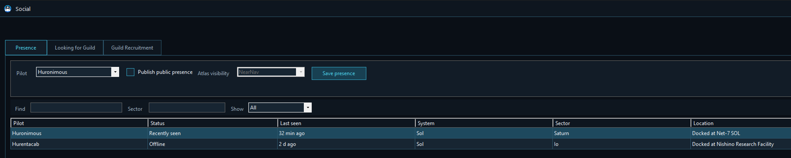
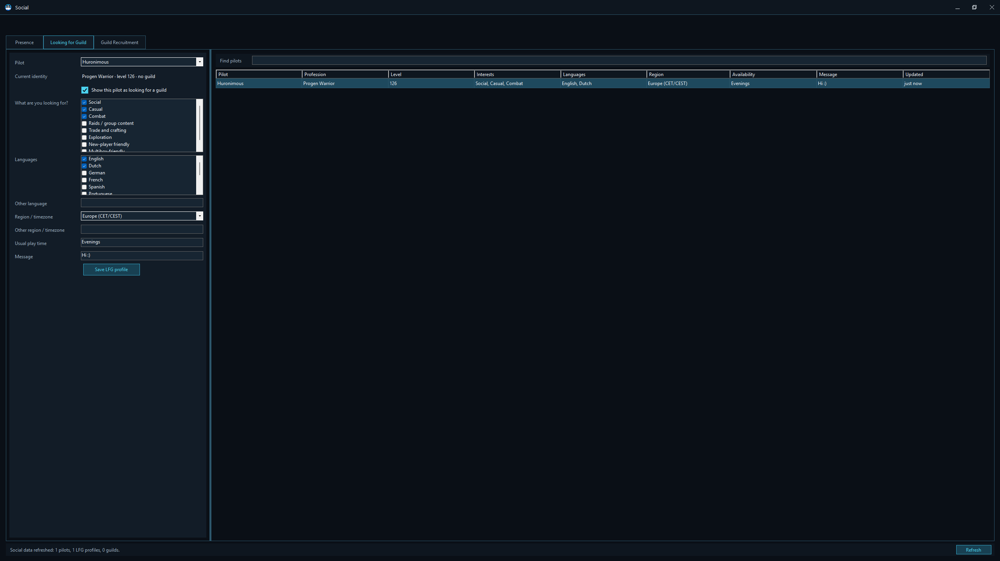
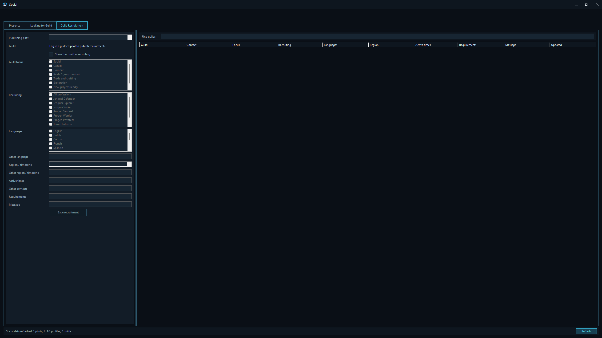

# Social

Social tools help pilots find one another without turning private location data into a compulsory beacon. Every published item is optional, and Atlas visibility is chosen by the pilot.

## Presence

Choose a running pilot and enable **Publish public presence** to appear in the Social directory.

Select an **Atlas visibility** level:

- Hidden from the Atlas.
- Share the current sector.
- Share a nearby navigation point.
- Share the exact observed position.

Save the presence choice for that pilot.

The directory can be filtered by text, sector, and state: all, online only, recently seen, or offline only. It shows pilot, status, last seen, system, sector, location, visibility, and looking-for-guild state.

Shared pilots can appear on the Galaxy Atlas according to the precision they allowed.

## Looking for Guild

The **Looking for Guild** tab publishes a pilot profile for recruiters.

Choose:

- The pilot.
- Whether the pilot is currently looking.
- Interests or preferred activities.
- Languages.
- Region or timezone.
- Usual play time.
- A free-form message.

The browser shows matching pilots with profession, level, interests, languages, region, availability, message, and update time.

## Guild Recruitment

A currently logged-in guild member can publish a recruitment profile for that guild.

The profile can include:

- Guild focus and activities.
- Professions being recruited.
- Languages.
- Region or timezone.
- Active times.
- Contact pilots.
- Requirements.
- Recruitment message.

The directory lets players compare guild, contact, focus, recruiting needs, languages, region, active times, requirements, message, and update time.

Publishing requires a guilded pilot because the manager uses the pilot’s observed guild identity rather than accepting an arbitrary guild name.

## Refreshing data

Social data refreshes while the owning pilot remains in game. Use **Refresh** for an immediate update. Closing or leaving the game closes the Social window associated with that client.
